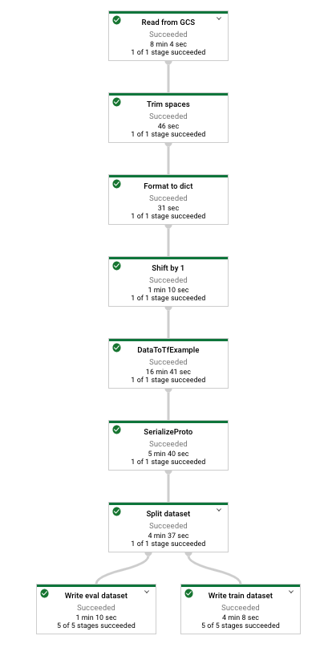
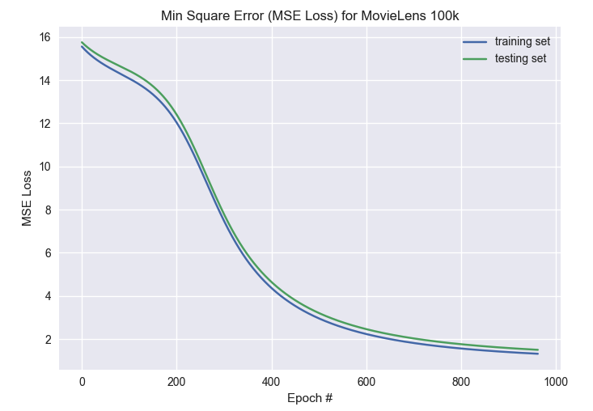
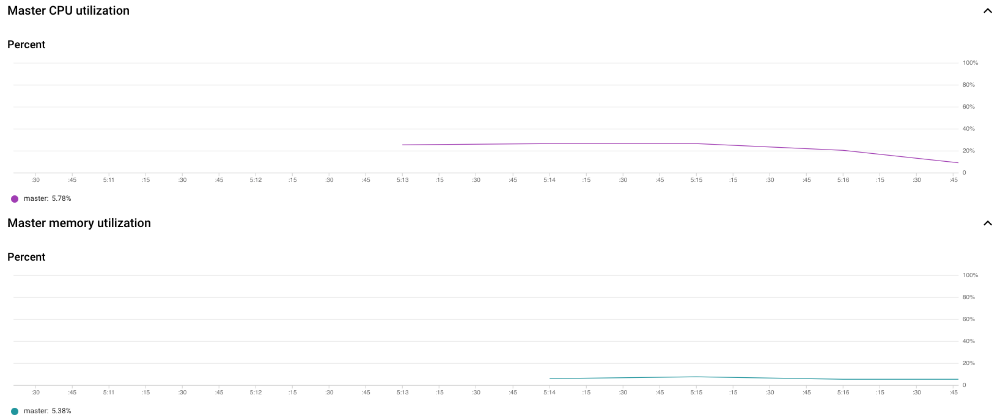
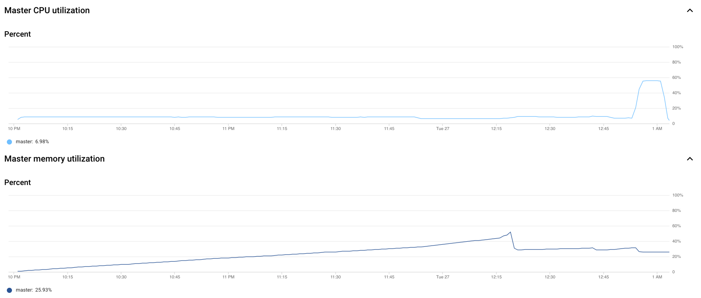

# Deep Dive Into Production ML workflow for Recommender System on GCP

> 🐻🎷 Scalable Collaborative Filtering End-to-end Model deployed on Google Cloud (GCS, Dataflow, Apache Beam, AI Platform)

<p align=center>
<a target="_blank" href="https://opensource.org/licenses/MIT" title="License: MIT"></a><a target="_blank" href="http://makeapullrequest.com" title="PRs Welcome"></a>
</p>  

## License

MIT License

## System Requirement

- Python 3.6
- tensorflow 1.15.0
- tensorflow-transform 0.21.2
- pache-beam[gcp] 2.17.0

## Billable Google Cloud Services

- ML Framework: **Tensorflow**
- Data Processing Unified Model: **Apache Beam**
- Data Pipelines, DAG analytics service: **Google Dataflow**
- ML back-end: **Google AI Platform**
- Database: **Google Cloud Storage**
- Dataset: **MovieLens 100k, MovieLens 25M**

## GCP setup

- project name: `reco-sys-capstone`
- GCS bucket name: `ahsu-movielens`
- region: `us-central1`
- AI platform job name: `"ahsu_movielens_$(date +%Y%m%d_%H%M%S)"`

## How-to

```Shell
$ # set up google cloud CLI tools
$ ./run-cloud.sh
```

## Directory Tree

```Shell
(ahsu) adrianhsu:~/Desktop/reco-sys-on-gcp (main)
$ tree
.
├── README.md
├── data-extractor.py
├── fig
│   ├── 100k-util.png
│   ├── 25m-util.png
│   ├── dataflow.png
│   └── loss-func.png
├── gitpush.sh
├── loss.txt
├── movielens.zip
├── plot.py
├── preprocess.py
├── run-cloud.sh
├── setup.py
└── trainer
    ├── __init__.py
    └── task.py
```

## Google Dataflow DAG

### Figure


### Step 1: read data and process them

```py
    dataset = (
      p
      | 'Read from GCS' >> beam.io.ReadFromText(os.path.join(data_dir, FILENAME), skip_header_lines = SKIP_HEADER)
      | 'Trim spaces' >> beam.Map(lambda x: x.split(",") if SPLIT_CHAR else x.split())
      | 'Format to dict' >> beam.Map(lambda x: {"user": x[0], "item": x[1], "rating": x[2]})
      | 'Shift by 1' >> beam.Map(shift_by_one)
    )
```

### Step 2: Data to TFExample + Split data into Train, Test set

```py
    train_dataset, eval_dataset = (
      dataset
      | 'DataToTfExample' >> beam.ParDo(data_to_tfexample)
      | 'SerializeProto' >> beam.Map(lambda x: x.SerializeToString())
      | 'Split dataset' >> beam.Partition(partitioning, 2, eval_percent) # train, eval -> 2
    ) 
```

### Step 3: Write to GCS as TF Record Format

```py
    train_dataset_prefix = os.path.join(train_dataset_dir, 'part')
    _ = (
      train_dataset
      | 'Write train dataset' >> tfrecordio.WriteToTFRecord(train_dataset_prefix)
      # | 'Write train dataset' >> beam.io.textio.WriteToText(train_dataset_prefix)
    )

    eval_dataset_prefix = os.path.join(eval_dataset_dir, 'part')
    _ = ( 
      eval_dataset
      | 'Write eval dataset' >> tfrecordio.WriteToTFRecord(eval_dataset_prefix)
      # | 'Write eval dataset' >> beam.io.textio.WriteToText(eval_dataset_prefix)
    )
```

## Model performance: MLE Loss function



## Cloud Resources Utilization

### `ahsu_movielens_20201026_171017`

* Dataset: MovieLens 100k
* Machine Type: `n1-standard-4`
* Virtual CPUs: 4
* Memory (GB): 15
* Only 1 master node

* Execution Time: 6 min 26 sec
* Consumed ML units: 0.06



### `ahsu_movielens_20201026_215825`

* Dataset: MovieLens 25M
* Machine Type: `n1-highmem-16`
* Virtual CPUs: 16
* Memory (GB): 104
* Only 1 master node

* Execution Time: 3 hr 4 min
* Consumed ML units: 5.76



### 2 workers: `ahsu_movielens_20201029_235922`

* Dataset: MovieLens 100k
* Machine Type: `n1-standard-4`
* Virtual CPUs: 4
* Memory (GB): 15
* 1 master node, 2 worker nodes

* Execution Time: 5 min 31 sec
* Consumed ML units: 0.1

### 4 workers: `ahsu_movielens_20201029_235935`

* Dataset: MovieLens 100k
* Machine Type: `n1-standard-4`
* Virtual CPUs: 4
* Memory (GB): 15
* 1 master node, 4 worker nodes

* Execution Time: 5 min 18 sec
* Consumed ML units: 0.32


### 2 workers: `ahsu_movielens_20201030_000018`

* Dataset: MovieLens 25M
* Machine Type: `n1-highmem-16`
* Virtual CPUs: 16
* Memory (GB): 104
* 1 master node, 2 worker nodes

* Execution Time: 
* Consumed ML units: 

### 4 workers: `ahsu_movielens_20201030_000018`

* Dataset: MovieLens 25M
* Machine Type: `n1-highmem-16`
* Virtual CPUs: 16
* Memory (GB): 104
* 1 master node, 2 worker nodes

* Execution Time: 
* Consumed ML units: 


## References


[1] Herlocker, J., Konstan, J., Borchers, A., Riedl, J.. An Algorithmic Framework for Performing Collaborative Filtering. In Proceedings of the 1999 Conference on Research and Development in Information
Retrieval. 1999.

http://files.grouplens.org/papers/algs.pdf

[2] H. Robbins et al., A Stochastic Approximation Method, 1951

https://projecteuclid.org/download/pdf_1/euclid.aoms/1177729586

[3] L´eon Bottou, Large-Scale Machine Learning with Stochastic Gradient Descent, COMPSTAT'2010

https://leon.bottou.org/publications/pdf/compstat-2010.pdf


[4] Google Cloud | Large-Scale Recommendation Systems - What and Why?

https://developers.google.com/machine-learning/recommendation/collaborative/basics

[5] Google Cloud | Machine Learning with Apache Beam and TensorFlow (Molecules Walkthrough)

https://cloud.google.com/dataflow/docs/samples/molecules-walkthrough

[6] Apache Beam: An advanced unified programming model

https://beam.apache.org/

[7] Google Dataflow: Unified stream and batch data processing that's serverless, fast, and cost-effective

https://cloud.google.com/dataflow

[8] Martın Abadi et al, TensorFlow: Large-Scale Machine Learning on Heterogeneous Distributed Systems, 2015

http://download.tensorflow.org/paper/whitepaper2015.pdf